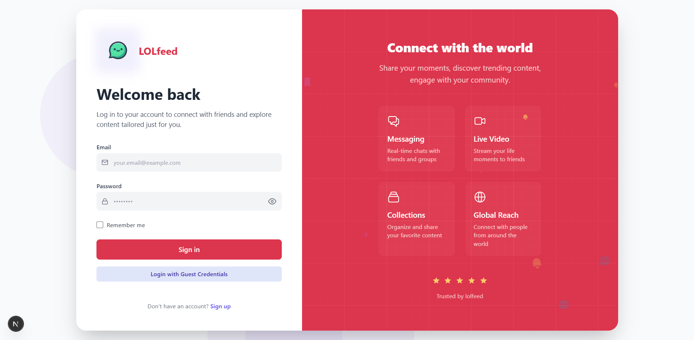
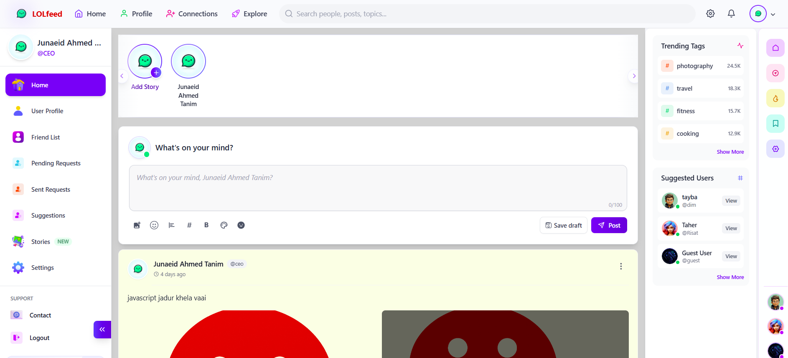
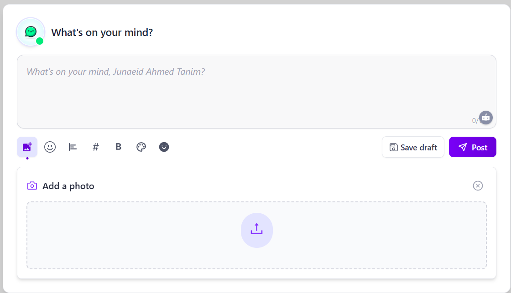
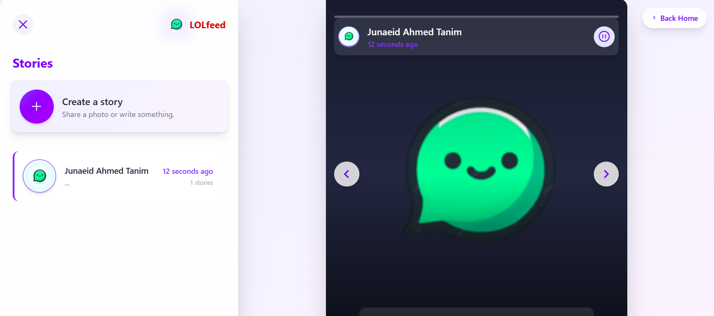

# 🌟 LolFeed – A Modern Social Media Platform



**Live Demo**: [https://lolfeed.vercel.app](https://lolfeed.vercel.app)

---

## 📌 Overview

**LolFeed** is a dynamic and responsive social media application inspired by Facebook. It offers a seamless user experience with features like post creation, user profiles, and interactive UI components. Built with modern web technologies, LolFeed ensures performance, scalability, and accessibility.

---

## 🚀 Features

✨ **User Authentication** – Secure login and registration system  
✨ **Profile Management** – View and edit profiles, upload profile and cover images  
✨ **Post Creation** – Create, edit, and delete posts with text and images  
✨ **Responsive Design** – Optimized for desktops, tablets, and mobile devices  
✨ **Interactive UI** – Smooth animations and transitions using Framer Motion  
✨ **Component Library** – Built with Shadcn/UI for accessibility and customization  
✨ **Dark Mode** – Toggle between light and dark themes  

---

## 🛠️ Technologies Used

- ⚛️ **Next.js** – React framework for server-side rendering and static site generation  
- 🎨 **Tailwind CSS** – Utility-first CSS framework for rapid UI development  
- 🧩 **Shadcn/UI** – Accessible and customizable component library built on Radix UI  
- 🎥 **Framer Motion** – Animation library for React  
- 🛡️ **TypeScript** – Typed JavaScript for better developer experience  
- 🚀 **Vercel** – Hosting and CI/CD for frontend apps  

---

## 📸 Screenshots

### 🏠 Home Page


### 👤 User Profile


### 📝 Post Creation


### 📝 Story Section


---

## 📂 Project Structure
Workspace
(rerun without)
Collecting workspace information

Filtering to most relevant information

├── frontend/ # Frontend application 
├── backend/ # Backend application 
├── public/ # Public assets 


---

## ⚙️ Getting Started


### 📦 Prerequisites

- Node.js (v14 or higher)
- npm or yarn

### 🧰 Installation

```bash
# Clone the repository
git clone https://github.com/Junaeid11/lolfeed.git
cd lolfeed

# Install frontend dependencies
cd frontend
npm install

# (Optional) Install backend dependencies
cd ../backend
npm install

   